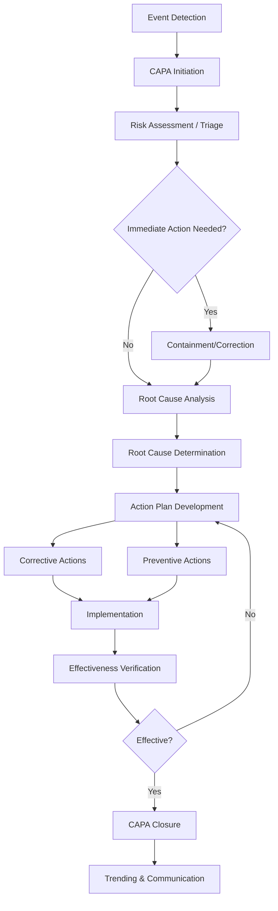

# CAPA Knowledge Base - Corrective and Preventive Action

## Comprehensive CAPA Reference for Pharmaceutical QMS

---

## Source References
- FDA 21 CFR 211.100, 211.180, 211.192, 211.198
- EU GMP Chapter 8 & Annex 15
- ICH Q10 - Pharmaceutical Quality System (Section 4.4)
- ICH Q9 - Quality Risk Management
- ISO 9001:2015 Clause 10.2
- FDA Guidance: Quality Systems Approach to Pharmaceutical cGMP
- PDA Technical Report 56 - CAPA
- ASQ Quality Tools
- Date Retrieved: 2026-07-28
- Confidence: 0.95

---

## 1. CAPA Definitions & Distinctions

### 1.1 Corrective Action (CA)
| Aspect | Description |
|--------|-------------|
| **Definition** | Action to eliminate the cause of a detected nonconformity or other undesirable situation |
| **Focus** | Reactive - addresses existing problem |
| **Question** | "What caused this specific failure?" |
| **Trigger** | Deviation, OOS, complaint, audit finding, recall, inspection observation |
| **Outcome** | Problem contained, root cause eliminated, recurrence prevented |

### 1.2 Preventive Action (PA)
| Aspect | Description |
|--------|-------------|
| **Definition** | Action to eliminate the cause of a potential nonconformity or other undesirable situation |
| **Focus** | Proactive - addresses potential future problems |
| **Question** | "What could cause a similar failure elsewhere?" |
| **Trigger** | Trend analysis, risk assessment (FMEA), near-misses, regulatory changes, technology changes |
| **Outcome** | Risk reduced, systemic improvement, future prevention |

### 1.3 Key Distinction
| Characteristic | Corrective Action | Preventive Action |
|----------------|-------------------|-------------------|
| **Timing** | After event | Before event |
| **Scope** | Specific instance | Systemic/potential |
| **Root Cause** | Known (investigation) | Potential (risk-based) |
| **Verification** | Effectiveness on specific issue | Effectiveness on risk reduction |

---

## 2. CAPA Process Flow (ICH Q10 / FDA / ISO 9001)



---

## 3. CAPA Process Steps - Detailed

### Step 1: CAPA Initiation & Risk Assessment
| Activity | Details | Tools |
|----------|---------|-------|
| **Source Identification** | Deviation, OOS, complaint, audit, inspection, trend, near-miss | CAPA log, tracking system |
| **Risk Assessment** | Impact on product quality, patient safety, regulatory compliance | Risk matrix (Severity × Probability) |
| **Severity Classification** | Critical/Major/Minor (see complaint severity) | Risk matrix |
| **Timeline Assignment** | Critical: 30 days, Major: 60 days, Minor: 90 days | CAPA SOP |
| **Team Assignment** | Cross-functional: QA, Production, Engineering, R&D, etc. | RACI matrix |
| **Containment** | Immediate actions to prevent further impact | Quarantine, hold, recall assessment |

### Step 2: Root Cause Analysis (RCA)
| Method | Best For | Output |
|--------|----------|--------|
| **5 Whys** | Simple, linear cause chains | Single root cause |
| **Fishbone/Ishikawa** | Multiple potential causes | Categorized causes (6M: Man, Machine, Material, Method, Measurement, Environment) |
| **Fault Tree Analysis (FTA)** | Complex system failures | Logic diagram of failure paths |
| **Failure Mode Effects Analysis (FMEA)** | Proactive risk, process design | RPN (Risk Priority Number) |
| **Pareto Analysis** | Trending, multiple events | Vital few vs trivial many |
| **Change Analysis** | Deviations after changes | What changed vs baseline |
| **Barrier Analysis** | Safety/quality barriers failed | Missing/ineffective barriers |
| **Timeline Analysis** | Sequential events | Event sequence, gaps |

### Step 3: Action Plan Development
| Element | Corrective Action | Preventive Action |
|---------|-------------------|-------------------|
| **Objective** | Eliminate root cause of specific event | Eliminate potential causes of similar events |
| **Scope** | Specific product, process, batch, equipment | Broader: similar products, processes, sites |
| **Actions** | Fix immediate cause, repair, rework, retrain | Redesign, procedural change, engineering control, automation |
| **Responsibility** | Specific owner, deadline | Specific owner, deadline |
| **Resources** | Defined budget, personnel, time | Defined budget, personnel, time |
| **Verification Plan** | How to prove CA worked | How to prove PA reduces risk |

### Step 4: Implementation
| Activity | Details |
|----------|---------|
| **Execution** | Perform actions per plan |
| **Documentation** | Records of each action, evidence |
| **Communication** | Stakeholder updates, training if needed |
| **Interim Verification** | Check progress, adjust if needed |

### Step 5: Effectiveness Verification (Critical Step)
| Verification Method | Description | Timing |
|---------------------|-------------|--------|
| **Trending** | Monitor same metric for recurrence | 3-12 months post-implementation |
| **Audit** | Internal audit of changed process | 30-90 days post-implementation |
| **Testing** | Challenge the fix (e.g., spike recovery) | Per protocol |
| **Simulation** | Mock scenario (e.g., mock recall) | Per protocol |
| **KPI Monitoring** | Track leading/lagging indicators | Ongoing |
| **Regulatory Feedback** | No repeat observations | Next inspection |

### Step 6: CAPA Closure
| Requirement | Details |
|-------------|---------|
| **All Actions Complete** | CA & PA implemented |
| **Verification Complete** | Evidence of effectiveness documented |
| **Documentation** | Full CAPA record with evidence |
| **Approval** | QA and Management sign-off |
| **Communication** | Lessons learned, trending update |
| **Archival** | Per retention policy |

---

## 4. CAPA Data Structure (JSON)

```json
{
  "capa_id": "CAPA-2026-0045",
  "initiated_date": "2026-07-28",
  "source": "Deviation",
  "source_reference": "DEV-2026-0715-001",
  "source_description": "Tablet weight variation >5% on Batch BN20260715A - Compression Press #3",
  "risk_assessment": {
    "severity": "Major",
    "probability": "Likely",
    "risk_level": "High",
    "patient_impact": "Potential dose variability - therapeutic failure or overdose risk",
    "regulatory_impact": "21 CFR 211.100, 211.103 - Process control failure",
    "business_impact": "Batch rejection, investigation cost, potential recall"
  },
  "team": {
    "lead": "Quality Engineer - J. Smith",
    "members": [
      "Production Supervisor - M. Chen",
      "Maintenance Engineer - R. Patel",
      "Process Engineer - L. Rodriguez",
      "QC Manager - K. Johnson"
    ]
  },
  "root_cause_analysis": {
    "method": "Fishbone + 5 Whys",
    "root_cause": "Worn compression tooling (upper punch tip erosion) causing inconsistent fill depth and weight variation",
    "contributing_factors": [
      "Tooling life exceeded 500k tablets (spec: 400k)",
      "No predictive maintenance for tooling wear",
      "In-process weight check frequency insufficient (30 min vs required 15 min for this product)"
    ],
    "rca_date": "2026-08-05",
    "rca_approved_by": "QA Manager"
  },
  "corrective_actions": [
    {
      "ca_id": "CA-001",
      "description": "Replace worn tooling set on Compression Press #3",
      "owner": "Maintenance Engineer",
      "due_date": "2026-08-10",
      "status": "Complete",
      "evidence": "Tooling replacement WO-2026-0808, CoC from vendor"
    },
    {
      "ca_id": "CA-002",
      "description": "Re-process Batch BN20260715A through weight check station; reject out-of-spec tablets",
      "owner": "Production Supervisor",
      "due_date": "2026-08-12",
      "status": "Complete",
      "evidence": "Re-work record RW-2026-0811, 2.3% rejection rate"
    },
    {
      "ca_id": "CA-003",
      "description": "Increase IPC weight check frequency to every 15 minutes for Product X on all presses",
      "owner": "Process Engineer",
      "due_date": "2026-08-15",
      "status": "Complete",
      "evidence": "SOP-PROD-045 Rev 3, updated IPC schedule"
    }
  ],
  "preventive_actions": [
    {
      "pa_id": "PA-001",
      "description": "Implement predictive maintenance program for compression tooling based on tablet count and wear monitoring",
      "owner": "Maintenance Manager",
      "due_date": "2026-10-01",
      "status": "In Progress",
      "evidence": "Draft PM program PM-PROG-2026-012"
    },
    {
      "pa_id": "PA-002",
      "description": "Standardize tooling life limits across all products/presses; integrate into CMMS with automatic alerts at 80% life",
      "owner": "Maintenance Engineer",
      "due_date": "2026-09-15",
      "status": "Not Started",
      "evidence": null
    },
    {
      "pa_id": "PA-003",
      "description": "Revise IPC frequency risk assessment for all tablet products; implement risk-based IPC schedule",
      "owner": "Process Engineer",
      "due_date": "2026-09-30",
      "status": "In Progress",
      "evidence": "Risk assessment RA-PROD-2026-045 draft"
    },
    {
      "pa_id": "PA-004",
      "description": "Extend tooling wear monitoring to all compression presses (Press #1, #2, #4, #5)",
      "owner": "Maintenance Engineer",
      "due_date": "2026-09-30",
      "status": "Not Started",
      "evidence": null
    }
  ],
  "verification": {
    "method": "Trending + Audit",
    "metrics_monitored": [
      "Tablet weight variation (%RSD) - target <2%",
      "Tooling life vs actual replacement (target: replace at ≤80% rated life)",
      "IPC frequency compliance (100% per schedule)",
      "Number of weight-related deviations (target: 0)"
    ],
    "verification_start": "2026-08-15",
    "verification_end": "2026-11-15",
    "interim_check_30d": "2026-09-15 - All CAs implemented; weight variation improved to 1.8% RSD",
    "interim_check_60d": "2026-10-15 - PA-001 50% complete; PA-003 75% complete",
    "final_verification": "2026-11-15 - All PAs implemented; 90 days zero weight deviations; CAPA effective",
    "effectiveness_conclusion": "Effective - Root cause eliminated; systemic improvements implemented",
    "verified_by": "QA Manager",
    "verification_date": "2026-11-15"
  },
  "closure": {
    "closure_date": "2026-11-20",
    "closed_by": "QA Director",
    "lessons_learned": [
      "Tooling life tracking must be automated, not manual logbook",
      "IPC frequency should be risk-based, not fixed",
      "Predictive maintenance prevents quality events"
    ],
    "trending_update": "Added to QMS trending dashboard; shared in monthly quality meeting"
  },
  "regulatory": {
    "field_alert_required": false,
    "recall_assessment": "Not required - batch reworked and released",
    "regulatory_notification": "None required"
  },
  "status": "Closed"
}
```

---

## 5. CAPA Metrics & KPIs

### 5.1 Leading Indicators (Predictive)
| KPI | Target | Frequency |
|-----|--------|-----------|
| **CAPA Initiation Rate** | Trending (not absolute) | Monthly |
| **CAPA Overdue Rate** | <5% | Weekly |
| **Root Cause Completion Time** | Critical: ≤14d, Major: ≤30d | Per CAPA |
| **Action Implementation Rate** | >90% on time | Monthly |
| **Preventive Action Ratio** | PA:CA ≥ 1:1 | Quarterly |
| **Repeat Root Cause Rate** | <10% | Quarterly |

### 5.2 Lagging Indicators (Outcome)
| KPI | Target | Frequency |
|-----|--------|-----------|
| **CAPA Effectiveness Rate** | >95% verified effective | Quarterly |
| **Recurrence Rate** | <5% same root cause within 12mo | Quarterly |
| **Regulatory Findings from CAPA** | 0 repeat 483 observations | Annual |
| **Customer Complaint Recurrence** | <3% same issue | Quarterly |
| **Batch Rejection Rate** | Trending downward | Monthly |

---

## 6. Common CAPA Failure Modes

| Failure Mode | Root Cause | Prevention |
|--------------|------------|------------|
| **Symptom Treated, Not Root Cause** | Shallow RCA (5 Whys stopped early) | Mandatory RCA method selection, QA review |
| **Only Corrective, No Preventive** | Reactive culture, time pressure | Mandatory PA section, ratio metric |
| **Actions Not Implemented** | No ownership, resource constraints | RACI, escalation, management review |
| **Effectiveness Not Verified** | "Closure" = actions done, not verified | Mandatory verification plan, timeline |
| **Same Root Cause Recurs** | Systemic fix not applied, scope too narrow | PA scope review, cross-site sharing |
| **CAPA Overdue** | Unrealistic timelines, competing priorities | Risk-based timelines, resource planning |
| **Poor Documentation** | Inadequate evidence, missing rationale | Template standardization, QA review gates |

---

## 7. CAPA Templates & Tools

### 7.1 Root Cause Analysis Template (Fishbone)

```
                    EFFECT: [Problem Statement]
                          |
        -------------------------------------------------
        |           |            |        |            |
    MANPOWER    MACHINE    MATERIAL   METHOD   ENVIRONMENT
        |           |            |        |            |
    - Training  - Wear       - Spec     - SOP     - Temp
    - Fatigue   - Calibrat.  - Lot      - Change  - Humid.
    - Skill     - Maint.     - Supplier - Param.  - Light
```

### 7.2 5 Whys Template
```
Problem: [Statement]
1. Why? → Answer
2. Why? → Answer
3. Why? → Answer
4. Why? → Answer
5. Why? → Root Cause
```

### 7.3 CAPA Effectiveness Verification Plan Template
| Metric | Baseline | Target | Measurement Method | Frequency | Duration | Owner |
|--------|----------|--------|-------------------|-----------|----------|-------|
| Weight variation %RSD | 5.2% | <2.0% | IPC data | Per batch | 90 days | Process Eng |
| Tooling replacement compliance | 60% | 100% at ≤80% life | CMMS report | Monthly | 90 days | Maint Eng |
| Weight-related deviations | 3/qtr | 0 | Deviation log | Quarterly | 90 days | QA |

---

## 8. CAPA Integration with Other QMS Processes

| Process | Integration Point |
|---------|-------------------|
| **Deviations** | Major/Critical deviations → CAPA initiation |
| **OOS/OOT** | Confirmed lab error → CAPA; Process-related → CAPA |
| **Complaints** | Critical/Major severity → CAPA; Trending → PA |
| **Audit Findings** | All GMP findings → CAPA (CA for finding, PA for systemic) |
| **Change Control** | Failed change → CAPA; CAPA implementation → Change control |
| **Risk Management (ICH Q9)** | CAPA = Risk control verification; FMEA updates |
| **Management Review** | CAPA metrics, effectiveness, trends presented |
| **Training** | CAPA actions → Training needs assessment |
| **Vendor Management** | Vendor-related root causes → Vendor CAPA |

---

## Metadata

```json
{
  "document_id": "capa_knowledge_base",
  "category": "CAPA",
  "subcategory": "capa_reference",
  "source_type": "Compiled_Regulatory_Technical_Reference",
  "authority": "FDA/EMA/ICH/ISO/ASQ/PDA",
  "version": "2026.1",
  "format": "Markdown",
  "retrieved": "2026-07-28",
  "confidence": 0.95,
  "tags": ["CAPA", "Corrective_Action", "Preventive_Action", "Root_Cause_Analysis", "Effectiveness_Verification", "Quality_Management", "ICH_Q10", "Risk_Management", "Deviation", "Complaint", "Audit_Finding", "Change_Control"]
}
```