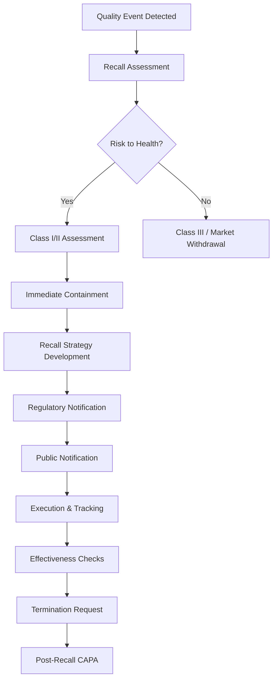

# FDA Recalls Knowledge Base

## Comprehensive Recall Reference for Pharmaceutical QMS

---

## Source References
- FDA 21 CFR Part 7 (Enforcement Policy)
- FDA Guidance: Recall Procedures for Industry
- FDA Guidance: Public Warning and Notification of Recalls
- EU GMP Chapter 8 (Complaints and Product Recall)
- Health Canada Recall Guidance
- WHO TRS 961 Annex 3
- PIC/S PE 009-14
- Date Retrieved: 2026-07-28
- Confidence: 0.95

---

## 1. Recall Classification System

### 1.1 FDA Recall Classes

| Class | Definition | Health Hazard | Public Notification | Examples |
|-------|------------|---------------|---------------------|----------|
| **Class I** | Reasonable probability of serious adverse health consequences or death | **High** | **Mandatory** - Press release, FDA website, direct notification | Contamination (sterility, microbial), wrong drug/strength, toxic impurity >PDE, labeling error causing overdose |
| **Class II** | Temporary or medically reversible adverse consequences; remote probability of serious harm | **Moderate** | FDA website, may issue press release | Dissolution failure, impurity >spec but <toxic, labeling error (non-safety), packaging defect |
| **Class III** | Not likely to cause adverse health consequences | **Low** | FDA website (Enforcement Report) | Minor packaging defect, labeling error (administrative), cGMP violation no quality impact |
| **Market Withdrawal** | Minor violation, no legal action by FDA | **None** | Company discretion | Routine stock rotation, minor cosmetic defect |

### 1.2 EU Recall Classification
| Class | Definition | Action |
|-------|------------|--------|
| **Class 1** | Serious risk to health | Immediate recall, public warning |
| **Class 2** | Potential risk to health | Recall within 48h, inform healthcare |
| **Class 3** | No risk to health, quality defect | Recall within 5 days, pharmacist level |
| **Class 4** | Minor defect, no health risk | Wholesale level, no public notification |

---

## 2. Recall Process Flow



---

## 3. Recall Data Structure (JSON)

```json
{
  "recall_id": "REC-2026-0045",
  "initiation_date": "2026-07-15",
  "recall_class": "Class I",
  "recall_type": "Voluntary",
  "product": {
    "name": "SteriDose 50mg/mL Injection",
    "strength": "50mg/mL",
    "dosage_form": "Solution for Injection",
    "batch_numbers": ["INJ20260601A", "INJ20260605B", "INJ20260610C"],
    "manufacturing_dates": ["2026-06-01", "2026-06-05", "2026-06-10"],
    "expiry_dates": ["2028-05-31", "2028-06-04", "2028-06-09"],
    "ndc_number": "12345-678-90",
    "manufacturer": "PharmaCorp Inc."
  },
  "reason": {
    "description": "Sterility failure - Bacillus subtilis detected in media fill simulation and confirmed in retained samples",
    "root_cause": "HEPA filter integrity failure in ISO 5 filling zone during Batch INJ20260605B production",
    "discovery_method": "Routine environmental monitoring trend + media fill failure",
    "detection_date": "2026-07-10"
  },
  "health_hazard": {
    "classification": "Class I",
    "hazard_description": "Parenteral administration of contaminated product may cause sepsis, bacteremia, endocarditis, or death in immunocompromised patients",
    "patient_population": "All patients receiving IV injection",
    "severity": "Life-threatening"
  },
  "recall_strategy": {
    "level": "Consumer/User Level (Hospital, Pharmacy, Patient)",
    "geographic_scope": "Nationwide (USA), Canada, EU",
    "depth": "Retail, Hospital, Wholesale, Distributor",
    "communication_method": "Press release, FDA website, Direct notification to accounts, Website posting",
    "instructions": "Stop use immediately, quarantine, return to distributor for credit/destruction"
  },
  "notifications": {
    "fda_district_office": "2026-07-11",
    "fda_recall_coordinator": "2026-07-11",
    "state_health_departments": "2026-07-12",
    "direct_accounts": "2026-07-12 (500+ accounts)",
    "healthcare_professionals": "2026-07-12 (via medical societies)",
    "public_press_release": "2026-07-12",
    "fda_website_posting": "2026-07-12",
    "international": "Health Canada (2026-07-12), EMA (2026-07-12)"
  },
  "execution": {
    "total_units_distributed": 150000,
    "units_recovered": 142500,
    "recovery_rate": "95.0%",
    "effectiveness_checks": {
      "level_a": "100% of direct accounts contacted",
      "level_b": "95% of sub-accounts contacted",
      "level_c": "90% of retail pharmacies contacted",
      "level_d": "Patient notification via pharmacy records"
    },
    "destruction_method": "Incineration at licensed facility",
    "destruction_certificates": "DEST-2026-0720-001 through 015"
  },
  "timeline": {
    "event_detected": "2026-07-10",
    "decision_to_recall": "2026-07-11",
    "fda_notified": "2026-07-11",
    "public_notification": "2026-07-12",
    "execution_start": "2026-07-12",
    "effectiveness_check_1": "2026-07-26",
    "effectiveness_check_2": "2026-08-09",
    "termination_requested": "2026-09-15",
    "fda_termination": "2026-10-01"
  },
  "root_cause_analysis": {
    "method": "Fishbone + 5 Whys",
    "root_cause": "HEPA filter #F-007 in Filling Room A integrity failure due to delayed filter replacement beyond qualified life",
    "contributing_factors": [
      "Filter life tracking in paper logbook only",
      "No automated alert at 90% filter life",
      "Media fill frequency insufficient (annual vs risk-based)"
    ]
  },
  "capa": {
    "capa_id": "CAPA-2026-0089",
    "corrective_actions": [
      "Replace all HEPA filters in Filling Room A",
      "Retest all retained samples from affected batches",
      "Destroy all recalled product"
    ],
    "preventive_actions": [
      "Implement CMMS-based filter life tracking with 90% alerts",
      "Increase media fill frequency to semi-annual for high-risk lines",
      "Implement continuous particle monitoring with real-time alerts"
    ]
  },
  "regulatory_outcome": {
    "fda_classification": "Class I",
    "fda_termination_date": "2026-10-01",
    "effectiveness_accepted": true,
    "post_recall_inspection": "2026-11-15 (No 483s)"
  },
  "financial_impact": {
    "product_value": "$45,000,000",
    "recall_execution_cost": "$2,500,000",
    "destruction_cost": "$500,000",
    "legal_reserves": "$10,000,000"
  }
}
```

---

## 4. Recall Effectiveness Levels

| Level | Description | Target |
|-------|-------------|--------|
| **Level A** | Direct accounts (wholesalers, distributors) | 100% contacted |
| **Level B** | Sub-accounts (hospitals, pharmacies) | ≥95% contacted |
| **Level C** | Retail/end-user | ≥90% contacted |
| **Level D** | Patient/consumer | Best effort (varies) |

### Effectiveness Check Timeline
| Check | Timing | Purpose |
|-------|--------|---------|
| **Initial** | 2 weeks | Verify notification received |
| **Intermediate** | 4 weeks | Verify quarantine/return initiation |
| **Final** | 8-12 weeks | Verify recovery rate ≥ target |

---

## 5. Field Alert Reports (FAR) - 21 CFR 211.198

### FAR Triggers (3 Working Days)
| Trigger | Examples |
|---------|----------|
| **Contamination** | Microbial, particulate, cross-contamination |
| **Mislabeling** | Wrong drug, wrong strength, missing warnings |
| **Potency Failure** | Assay <90% or >110%, content uniformity failure |
| **Sterility Failure** | Injectable, ophthalmic, sterile products |
| **Stability Failure** | Out-of-spec at expiry or accelerated conditions |

### FAR Content Requirements
| Element | Required |
|---------|----------|
| Product name, strength, NDC | Yes |
| Batch/lot numbers | Yes |
| Description of problem | Yes |
| Root cause (if known) | Yes |
| Health hazard assessment | Yes |
| Corrective actions | Yes |
| Distribution information | Yes |
| Recall status | Yes |

---

## 6. Recall Metrics & KPIs

| KPI | Target | Frequency |
|-----|--------|-----------|
| **Recall Initiation Time** | <24h from decision | Per recall |
| **Notification Completeness** | 100% direct accounts | Per recall |
| **Recovery Rate** | Class I: ≥95%, Class II: ≥90%, Class III: ≥80% | Per recall |
| **Effectiveness Check Completion** | 100% on schedule | Per recall |
| **Recall Termination Time** | Class I: ≤90 days, Class II: ≤180 days | Per recall |
| **Recall Recurrence Rate** | 0 same root cause | Annual |
| **FAR Timeliness** | 100% within 3 working days | Monthly |

---

## 7. International Recall Coordination

| Region | Authority | Key Requirements |
|--------|-----------|------------------|
| **USA** | FDA | 21 CFR Part 7, FAR (3 days) |
| **EU** | EMA / NCAs | 24h for Class 1, 48h for Class 2 |
| **Canada** | Health Canada | 24h for Type I, 72h for Type II |
| **Japan** | PMDA | Immediate for Class I |
| **Australia** | TGA | 24h for urgent, 72h for non-urgent |
| **WHO** | WHO | Rapid Alert for international distribution |

---

## 8. Recall Readiness Checklist

### Pre-Recall Preparation
- [ ] Recall SOP current and tested
- [ ] Recall team designated with alternates
- [ ] Communication templates approved
- [ ] Distribution records accessible (24/7)
- [ ] Traceability system validated (batch → patient)
- [ ] Mock recall conducted annually
- [ ] Regulatory contact lists current
- [ ] Destruction/disposal contracts in place
- [ ] Insurance coverage verified
- [ ] Legal counsel engaged

### Mock Recall Requirements
| Element | Requirement |
|---------|-------------|
| **Frequency** | At least annually |
| **Scope** | Full traceability (raw material → patient) |
| **Time Limit** | Complete within 4 hours |
| **Recovery Target** | ≥98% of test batch |
| **Documentation** | Full report with timelines |
| **Participants** | Cross-functional team |
| **Corrective Actions** | Track and close gaps |

---

## Metadata

```json
{
  "document_id": "fda_recalls_knowledge_base",
  "category": "FDA_recalls",
  "subcategory": "recall_management",
  "source_type": "Compiled_Regulatory_Reference",
  "authority": "FDA/EMA/Health_Canada/WHO/PIC_S",
  "version": "2026.1",
  "format": "Markdown",
  "retrieved": "2026-07-28",
  "confidence": 0.95,
  "tags": ["FDA_Recalls", "Recall_Management", "Class_I_II_III", "Field_Alert_Report", "Recall_Effectiveness", "Mock_Recall", "Recall_Readiness", "21_CFR_Part_7", "21_CFR_211_198", "EU_GMP_Chapter_8", "Pharmacovigilance"]
}
```