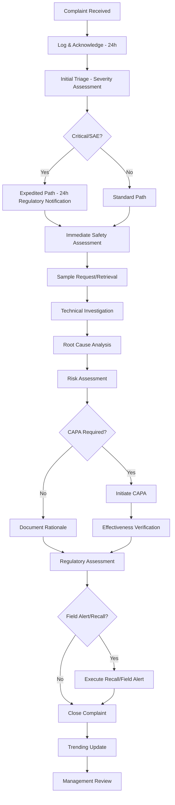

# Complaint Categories and Terminology for Pharmaceutical QMS

## Overview
Structured classification system for customer complaints in pharmaceutical manufacturing, aligned with FDA 21 CFR 211.198, EU GMP Chapter 8, ICH Q10, and WHO GMP requirements.

## Source References
- FDA 21 CFR 211.198 - Complaint files
- EU GMP Chapter 8 - Complaints and product recall
- ICH Q10 - Pharmaceutical Quality System (Section 4.3)
- WHO TRS 961 Annex 3 - GMP: Complaints and recalls
- PIC/S PI 004 - Guidance on complaint handling
- Date Retrieved: 2026-07-28
- Confidence: 0.95

---

## 1. Complaint Category Hierarchy

### Level 1: Primary Categories

| Category Code | Category Name | Description | Regulatory Criticality |
|--------------|---------------|-------------|----------------------|
| **PC** | **Product Quality Complaint** | Defect in identity, strength, quality, purity of drug product | **Critical** - Direct patient impact |
| **PK** | **Packaging/Labeling Complaint** | Defect in container, closure, label, carton, leaflet | **Major** - May affect identity, stability, usability |
| **LG** | **Logistics/Distribution Complaint** | Damage, temperature excursion, wrong shipment, delay | **Major** - May compromise product quality |
| **AD** | **Adverse Drug Reaction (ADR) Report** | Suspected adverse reaction associated with product | **Critical** - Pharmacovigilance obligation |
| **MD** | **Medication Error** | Error in prescribing, dispensing, administration | **Major** - Use-related safety |
| **RF** | **Regulatory/Filing Inquiry** | Questions about approvals, certificates, specifications | **Minor** - Administrative |
| **OT** | **Other/General Inquiry** | Pricing, availability, technical support, samples | **Minor** - Non-quality |

---

### Level 2: Product Quality Subcategories (PC)

| Sub-Code | Subcategory | Examples | Typical Root Cause Area |
|----------|-------------|----------|------------------------|
| **PC-01** | **Physical Defect - Tablet/Capsule** | Chipped, cracked, broken, cracked cap, empty capsule, double imprint, missing imprint, sticking, picking, lamination, capping | Compression, encapsulation, tooling |
| **PC-02** | **Physical Defect - Liquid/Sterile** | Particulates, precipitation, discoloration, cloudiness, gas bubbles, incorrect fill volume | Filtration, filling, sterilization |
| **PC-03** | **Physical Defect - Semi-solid** | Phase separation, grittiness, foreign matter, color variation, odor | Mixing, homogenization, filling |
| **PC-04** | **Assay/Content Uniformity** | Sub-potent, super-potent, content uniformity failure, degradation products >spec | Manufacturing, stability, raw material |
| **PC-05** | **Impurity/Contamination** | Related substances >spec, residual solvents, elemental impurities, nitrosamines, cross-contamination | Synthesis, purification, cleaning |
| **PC-06** | **Microbiological** | Sterility failure, TAMC/TYMC >spec, specified organisms, endotoxin, mycoplasma | Aseptic process, environment, raw material |
| **PC-07** | **Dissolution/Disintegration** | Dissolution profile failure, disintegration time >spec | Formulation, compression, coating |
| **PC-08** | **Stability/Degradation** | Premature degradation, out-of-spec at expiry, impurity growth | Formulation, packaging, storage |
| **PC-09** | **Foreign Matter** | Glass, metal, plastic, fiber, hair, insect parts in product | Equipment, environment, personnel |
| **PC-10** | **Wrong Product/Strength** | Incorrect API, wrong strength, wrong dosage form | Labeling, dispensing, line clearance |

---

### Level 2: Packaging/Labeling Subcategories (PK)

| Sub-Code | Subcategory | Examples |
|----------|-------------|----------|
| **PK-01** | **Container Defect** | Cracked bottle, broken ampoule, deformed tube, leaking vial |
| **PK-02** | **Closure Defect** | Loose cap, missing seal, broken tamper-evident, child-resistant failure |
| **PK-03** | **Label Defect - Content** | Wrong label, missing info, incorrect strength, expired date, wrong language |
| **PK-04** | **Label Defect - Physical** | Peeling, smudged, illegible, misaligned, wrong label on container |
| **PK-05** | **Carton/Secondary Defect** | Damaged carton, missing carton, wrong carton, printing error |
| **PK-06** | **Leaflet/Insert Defect** | Missing, wrong version, damaged, illegible, wrong language |
| **PK-07** | **Serialization/Track-Trace** | Missing code, unreadable code, duplicate, aggregation error |
| **PK-08** | **Tamper Evidence Failure** | Seal intact but product accessed, seal missing, broken seal on receipt |

---

### Level 2: Logistics/Distribution Subcategories (LG)

| Sub-Code | Subcategory | Examples |
|----------|-------------|----------|
| **LG-01** | **Temperature Excursion** | Cold chain breach, frozen product, heat exposure, data logger alarm |
| **LG-02** | **Physical Damage in Transit** | Crushed cartons, broken bottles, punctured packages |
| **LG-03** | **Wrong Shipment** | Wrong product, wrong quantity, wrong address, missing items |
| **LG-04** | **Delivery Delay** | Late delivery causing stockout, expiry risk |
| **LG-05** | **Documentation Error** | Wrong COA, missing import license, incorrect shipping docs |
| **LG-06** | **Counterfeit/Suspicious** | Suspected counterfeit, diversion, tampering evidence |

---

## 2. Complaint Severity Classification

### FDA/EU/WHO Aligned Severity Matrix

| Severity Level | Definition | Patient Impact | Regulatory Reporting | Response Timeline |
|----------------|------------|----------------|---------------------|-------------------|
| **Critical (S1)** | Life-threatening, death, permanent disability, congenital anomaly, hospitalization | Direct serious harm | **Immediate** (24h FDA, 15d EU) | **24 hours** |
| **Major (S2)** | Temporary/medically significant harm, requires intervention, product unusable | Significant harm possible | **Expedited** (5-15 days) | **5 business days** |
| **Minor (S3)** | Minor inconvenience, no medical intervention, cosmetic defect, usability issue | Negligible harm | **Routine** (30-90 days) | **15 business days** |
| **Inquiry (S4)** | Information request, no product defect alleged | None | **None** | **30 business days** |

### Severity Assignment Rules

| Complaint Type | Default Severity | Escalation Criteria |
|----------------|------------------|---------------------|
| **Death/SAE associated** | Critical (S1) | Any fatality or SAE linked to product |
| **Sterility failure** | Critical (S1) | Injectable/ophthalmic/inhalation |
| **Potency >±20% or toxic impurity** | Critical (S1) | Narrow therapeutic index drugs |
| **Particulates in injectable** | Critical (S1) | Glass, metal, visible particles |
| **Wrong drug/strength dispensed** | Critical (S1) | Medication error potential |
| **OOS assay/content uniformity** | Major (S2) | Finished product release failure |
| **Dissolution failure** | Major (S2) | Critical quality attribute |
| **Label mix-up (wrong strength)** | Major (S2) | Dosing error risk |
| **Temperature excursion (validated range)** | Major (S2) | Stability impact uncertain |
| **Minor packaging cosmetic** | Minor (S3) | No functional impact |
| **Missing leaflet** | Minor (S3) | Information available online |
| **General inquiry** | Inquiry (S4) | No product defect alleged |

---

## 3. Complaint Terminology - Customer vs QA Language

### Customer Language → QA Standard Term Mapping

| Customer Phrase | QA Standard Term | Category |
|-----------------|------------------|----------|
| "Pill is broken" | Tablet physical defect - chipped/cracked | PC-01 |
| "Capsule came apart" | Capsule physical defect - cap/body separation | PC-01 |
| "Liquid looks cloudy" | Solution clarity defect - precipitation/particulates | PC-02 |
| "Wrong color" | Color variation / discoloration | PC-02, PC-03 |
| "Smells bad" | Odor deviation / chemical odor | PC-03, PC-05 |
| "Tastes different" | Taste deviation | PC-03 |
| "Didn't work" | Lack of efficacy / therapeutic failure | PC-04, AD |
| "Made me sick" | Adverse drug reaction / adverse event | AD |
| "Wrong pill in bottle" | Product mix-up / wrong strength | PC-10 |
| "Label fell off" | Label adhesion failure | PK-04 |
| "Can't read expiration" | Label legibility defect | PK-04 |
| "Seal was broken" | Tamper evidence failure / closure defect | PK-02, PK-08 |
| "Box was crushed" | Transit damage / shipping damage | LG-02 |
| "Arrived warm" | Temperature excursion / cold chain breach | LG-01 |
| "Got wrong quantity" | Shipment shortage / overage | LG-03 |
| "Expire date passed" | Expired product / shelf life issue | PC-08, LG-04 |
| "Found hair/glass/metal" | Foreign matter contamination | PC-09 |
| "Tablets stuck together" | Twinning / picking / sticking | PC-01 |
| "Capsules leaking" | Capsule shell defect / fill leak | PC-01, PC-02 |
| "Powder spilled" | Fill weight variation / container defect | PC-02, PK-01 |

---

## 4. Complaint Data Structure (JSON Schema)

```json
{
  "complaint_id": "CMP-2026-001234",
  "receipt_date": "2026-07-28",
  "source": "Healthcare Professional|Patient|Distributor|Regulatory|Internal|Literature|Social Media",
  "country": "US",
  "product": {
    "name": "DrugX 10mg Tablets",
    "strength": "10mg",
    "dosage_form": "Tablet",
    "batch_number": "BN20260715A",
    "manufacturing_date": "2026-07-15",
    "expiry_date": "2028-07-14",
    "market_authorization": "NDA 123456"
  },
  "reporter": {
    "type": "Healthcare Professional",
    "name": "Dr. Jane Smith",
    "contact": "jane.smith@hospital.com",
    "facility": "General Hospital"
  },
  "patient": {
    "age_group": "Adult|Pediatric|Geriatric",
    "sex": "M|F|U",
    "initials": "JS",
    "weight_kg": 70
  },
  "complaint_details": {
    "category": "PC",
    "subcategory": "PC-01",
    "severity": "Major",
    "description_customer": "Tablets crumbling in bottle, powder at bottom",
    "description_qa": "Tablet physical defect - excessive friability/fragmentation",
    "quantity_affected": "30 tablets (1 bottle)",
    "sample_available": true,
    "sample_received": false
  },
  "adverse_event": {
    "reported": false,
    "meddra_terms": [],
    "seriousness": "Non-serious",
    "outcome": "Recovered|Recovering|Not Recovered|Fatal|Unknown"
  },
  "investigation": {
    "assigned_to": "Quality Engineer",
    "start_date": "2026-07-29",
    "root_cause": "Insufficient compression force during tablet compression - tooling wear",
    "root_cause_category": "Manufacturing Process - Equipment",
    "corrective_action": "Replace compression tooling; revise compression force specification; implement in-process friability testing every 30 min",
    "preventive_action": "Implement predictive maintenance for tablet presses; revise tooling life SOP",
    "capas": ["CAPA-2026-045", "CAPA-2026-046"],
    "batch_investigation": {
      "batches_reviewed": ["BN20260715A", "BN20260710B", "BN20260705C"],
      "trending": "Increasing friability trend over last 3 batches",
      "recall_assessment": "No recall - isolated to specific tooling set"
    },
    "closure_date": "2026-08-15",
    "closure_rationale": "Root cause confirmed; CAPAs implemented; no safety risk identified"
  },
  "regulatory": {
    "field_alert_reportable": false,
    "field_alert_number": null,
    "recall_initiated": false,
    "recall_class": null,
    "fda_notified": false,
    "ema_notified": false
  },
  "attachments": [
    {"type": "Photo", "filename": "CMP-2026-001234_photo1.jpg"},
    {"type": "COA", "filename": "BN20260715A_COA.pdf"},
    {"type": "Investigation_Report", "filename": "INV-2026-001234.pdf"}
  ],
  "status": "Closed",
  "tags": ["Friability", "Tablet_Compression", "Tooling_Wear", "In_Process_Control"]
}
```

---

## 5. Common Complaint Examples (Structured)

### Example 1: Sterility Failure - Injectable
```json
{
  "complaint_id": "CMP-2026-000001",
  "category": "PC",
  "subcategory": "PC-06",
  "severity": "Critical",
  "product": "DrugY 50mg/mL Injection",
  "batch": "INJ20260601",
  "description": "Visible particulates observed in vial during bedside inspection",
  "investigation": {
    "root_cause": "Inadequate aseptic technique during manual vial filling - operator intervention",
    "actions": ["Automate filling line", "Revise aseptic training", "Implement RABS"],
    "recall": "Class I - all batches from same filling campaign"
  }
}
```

### Example 2: Wrong Strength Label
```json
{
  "complaint_id": "CMP-2026-000002",
  "category": "PK",
  "subcategory": "PK-03",
  "severity": "Critical",
  "product": "DrugZ 20mg Tablets",
  "batch": "TAB20260515",
  "description": "Bottle labeled 20mg contains 40mg tablets - patient took double dose",
  "investigation": {
    "root_cause": "Label roll changeover error - previous 40mg label roll not fully removed",
    "actions": ["Implement label verification camera", "Revise changeover SOP", "Add reconciliation step"],
    "recall": "Class I - all bottles from packaging run"
  }
}
```

### Example 3: Temperature Excursion
```json
{
  "complaint_id": "CMP-2026-000003",
  "category": "LG",
  "subcategory": "LG-01",
  "severity": "Major",
  "product": "BioDrug 100mg/mL (2-8°C)",
  "batch": "BIO20260701",
  "description": "Shipment arrived at 15°C; data logger shows 4-hour excursion to 25°C during transit",
  "investigation": {
    "root_cause": "Gel pack insufficient for summer transit lane; carrier delay",
    "actions": ["Qualify enhanced packaging for summer", "Add real-time tracking", "Revise carrier SLA"],
    "impact": "Stability data supports 25°C for 72h - no quality impact"
  }
}
```

---

## 6. Trending & Signal Detection

### Key Trending Parameters
| Parameter | Frequency | Threshold for Signal |
|-----------|-----------|---------------------|
| **Complaint Rate** | Monthly | >2x 12-month rolling average |
| **Batch-Specific Rate** | Per batch | >3 complaints/batch or >1 Critical/batch |
| **Category Trend** | Quarterly | New category emerging or >50% increase |
| **Severity Shift** | Monthly | Critical % increasing >10% |
| **Geographic Cluster** | Monthly | >3 complaints same country/region in 30 days |
| **Product Family** | Quarterly | Common root cause across products |

### Signal Detection Triggers
- **3+ similar complaints** in 90 days → Formal investigation
- **1 Critical complaint** → Immediate CAPA
- **Batch trend** across 3+ consecutive batches → Process investigation
- **New failure mode** not in FMEA → FMEA update required
- **Regulatory inquiry** on same issue → Priority escalation

---

## 7. Complaint Handling Process Flow



---

## Metadata

```json
{
  "document_id": "complaint_categories_terminology",
  "category": "complaint_categories",
  "subcategory": "complaint_taxonomy",
  "source_type": "Compiled_Regulatory_Reference",
  "authority": "FDA/EMA/WHO/ICH/PIC_S",
  "version": "2026.1",
  "format": "Markdown",
  "retrieved": "2026-07-28",
  "confidence": 0.95,
  "tags": ["Complaint_Handling", "Pharmacovigilance", "Quality_Events", "Regulatory_Compliance", "CAPA", "Severity_Classification", "Root_Cause", "Signal_Detection"]
}
```

---

## Usage Notes

1. **Always map customer language** to standardized QA terminology upon receipt
2. **Severity drives timeline** - never downgrade without documented justification
3. **Every complaint** requires batch investigation scope assessment
4. **ADR reports** follow separate pharmacovigilance process (24h/15d reporting)
5. **Trending** must feed management review and continuous improvement
6. **Retention**: Complaint files retained per 21 CFR 211.180 (1 year past expiry) / EU GMP (5+ years)