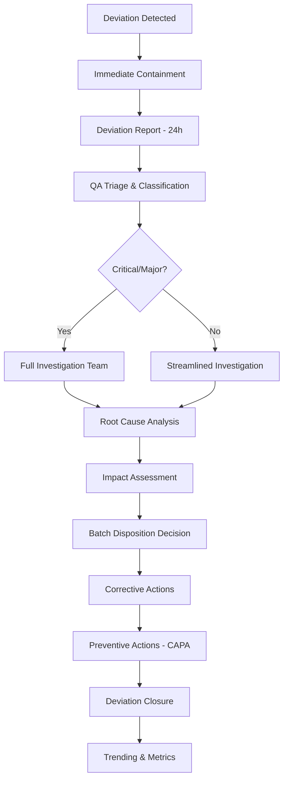

# Deviation Management Knowledge Base

## Comprehensive Deviation Reference for Pharmaceutical QMS

---

## Source References
- FDA 21 CFR 211.100, 211.111, 211.180, 211.192
- EU GMP Chapter 5 (Production) & Chapter 8 (Complaints/Recall)
- ICH Q7 Section 13 (Deviation Handling)
- ICH Q10 Section 4.3 (Deviation Management)
- PIC/S PE 009-14 (API GMP)
- PDA Technical Report 62 - Deviation Management
- FDA Guidance: Quality Systems Approach to Pharmaceutical cGMP
- Date Retrieved: 2026-07-28
- Confidence: 0.95

---

## 1. Deviation Definition & Classification

### 1.1 Deviation Definition
> **Deviation**: Any departure from an approved instruction, established standard, or documented procedure. Includes planned and unplanned deviations.

### 1.2 Deviation Categories

| Category | Definition | Examples | Immediate Action |
|----------|------------|----------|------------------|
| **Planned Deviation** | Pre-approved temporary departure from procedure | Holiday staffing, equipment maintenance window, supplier change with qualification | Pre-approved protocol, time-limited, documented |
| **Unplanned Deviation** | Unexpected departure requiring investigation | Equipment failure, human error, utility loss, OOS result | Containment, investigation, CAPA assessment |
| **Critical Deviation** | Direct impact on product quality, safety, efficacy, or regulatory compliance | Sterility failure, cross-contamination, wrong API, data integrity breach | Immediate containment, 24h QA notification, CAPA mandatory |
| **Major Deviation** | Significant potential impact on product quality | Process parameter OOS, missing critical IPC, labeling mix-up | Containment, 48h investigation start, CAPA likely |
| **Minor Deviation** | Low probability of impact on product quality | Documentation error (non-critical), administrative delay, cosmetic defect | Documentation, trending, CAPA if trend |

### 1.3 Deviation Severity Matrix

| Severity | Product Impact | Patient Risk | Regulatory | Timeline | CAPA |
|----------|----------------|--------------|------------|----------|------|
| **Critical** | Product quality/safety compromised | Serious harm/death possible | Field Alert, Recall possible | Immediate containment, 24h report | Mandatory |
| **Major** | Product quality potentially affected | Significant harm possible | Possible recall | 48h investigation | Usually required |
| **Minor** | Negligible quality impact | Negligible harm | Trending only | 15 business days | If trend |

---

## 2. Deviation Management Process Flow



---

## 3. Deviation Data Structure (JSON)

```json
{
  "deviation_id": "DEV-2026-0715-001",
  "report_date": "2026-07-15",
  "detection_date": "2026-07-15",
  "detection_method": "In-Process Control",
  "reported_by": "Production Operator - A. Kumar",
  "product": {
    "name": "DrugX 10mg Tablets",
    "batch_number": "BN20260715A",
    "stage": "Compression",
    "equipment": "Compression Press #3"
  },
  "deviation_type": "Unplanned",
  "severity": "Major",
  "category": "Process Parameter",
  "description": {
    "what_happened": "Tablet weight variation exceeded 5% RSD during compression run. Target: 200mg ±5%. Actual range: 188-212mg (5.2% RSD). 2,340 tablets produced before detection.",
    "when_detected": "2026-07-15 14:30 - IPC weight check at 30-min interval",
    "where_detected": "Compression Press #3, IPC Station",
    "quantity_affected": "2,340 tablets (partial batch)"
  },
  "immediate_containment": {
    "actions": [
      "Press stopped at 14:35",
      "Affected tablets quarantined (QUAR-2026-0715-001)",
      "QA notified at 14:36",
      "No product released"
    ],
    "containment_time": "2026-07-15 14:36",
    "effectiveness": "Effective - no affected product reached warehouse"
  },
  "investigation": {
    "team": [
      "QA Lead - S. Sharma",
      "Production Supervisor - M. Chen",
      "Maintenance Engineer - R. Patel",
      "Process Engineer - L. Rodriguez"
    ],
    "start_date": "2026-07-15",
    "root_cause_method": "Fishbone + 5 Whys",
    "root_cause": "Worn compression tooling (upper punch tip erosion) causing inconsistent fill depth",
    "contributing_factors": [
      "Tooling exceeded rated life (520k tablets vs 400k spec)",
      "No predictive maintenance program for tooling wear",
      "IPC frequency (30 min) insufficient for high-speed press"
    ],
    "impact_assessment": {
      "product_quality": "Weight variation may cause dose variability - therapeutic failure/overdose risk",
      "patient_safety": "Potential for sub-therapeutic or supratherapeutic dose",
      "regulatory": "21 CFR 211.100 (written procedures), 211.103 (component charge), 211.111 (time limitations)",
      "batch_disposition": "Quarantined - rework/reject decision pending"
    }
  },
  "batch_disposition": {
    "decision": "Rework",
    "rework_plan": "Pass quarantined tablets through 100% weight check station; reject out-of-spec; re-blend acceptable tablets",
    "rework_batch_record": "RW-2026-0718-001",
    "rework_yield": "97.7% (60 tablets rejected)",
    "final_release": "2026-07-20 after rework QC testing"
  },
  "corrective_actions": [
    {
      "ca_id": "CA-001",
      "description": "Replace worn tooling set on Compression Press #3",
      "owner": "Maintenance Engineer",
      "due_date": "2026-07-20",
      "status": "Complete",
      "verification": "Tooling replaced WO-2026-0718; first article inspection passed"
    },
    {
      "ca_id": "CA-002",
      "description": "Increase IPC weight check frequency to 15 min for Product X on all presses",
      "owner": "Process Engineer",
      "due_date": "2026-07-22",
      "status": "Complete",
      "verification": "SOP-PROD-045 Rev 3 issued"
    }
  ],
  "preventive_actions": [
    {
      "pa_id": "PA-001",
      "description": "Implement predictive maintenance for compression tooling",
      "owner": "Maintenance Manager",
      "due_date": "2026-09-30",
      "status": "Open"
    },
    {
      "pa_id": "PA-002",
      "description": "Standardize tooling life limits and integrate into CMMS",
      "owner": "Maintenance Engineer",
      "due_date": "2026-08-31",
      "status": "Open"
    }
  ],
  "capa_reference": "CAPA-2026-0045",
  "closure": {
    "closure_date": "2026-08-10",
    "closed_by": "QA Manager",
    "closure_rationale": "Root cause confirmed; corrective actions implemented and verified; batch reworked and released; preventive actions tracked in CAPA-2026-0045"
  },
  "trending": {
    "similar_deviations_12mo": 3,
    "trend_direction": "Increasing",
    "signal_detected": true
  },
  "regulatory": {
    "field_alert_required": false,
    "recall_assessment": "Not required - batch reworked",
    "notification_sent": "None"
  },
  "attachments": [
    "IPC Record IPC-2026-0715-03",
    "Quarantine Tag QUAR-2026-0715-001",
    "Investigation Report INV-2026-0715-001",
    "Rework Record RW-2026-0718-001",
    "CAPA Reference CAPA-2026-0045"
  ]
}
```

---

## 4. Common Deviation Types by Manufacturing Stage

### 4.1 API Manufacturing Deviations
| Stage | Common Deviations | Critical Parameters |
|-------|-------------------|---------------------|
| **Reaction** | Temp excursion, pressure excursion, wrong stoichiometry, incomplete reaction, wrong catalyst | Temp ±2°C, Pressure ±0.5 bar, Addition rate ±5% |
| **Crystallization** | Wrong polymorph, incorrect crystal size, high impurity, mother liquor contamination | Cooling rate ±0.1°C/min, Seeding point ±0.5°C |
| **Filtration** | Filter media bypass, filter integrity failure, cake washing inadequate | Pressure differential, filtrate clarity |
| **Drying** | Over/under drying, temperature excursion, cross-contamination | LOD spec, Temp ±2°C, Time |
| **Milling/Sieving** | Incorrect PSD, screen integrity failure, metal contamination | PSD D10/D50/D90, Screen integrity |

### 4.2 FDF Manufacturing Deviations
| Stage | Common Deviations | Critical Parameters |
|-------|-------------------|---------------------|
| **Dispensing** | Wrong material, wrong quantity, cross-contamination, environment OOS | Weight ±0.1%, Identity, RH/Temp |
| **Granulation** | End-point missed, over/under granulation, high/low moisture, binder error | LOD, PSD, Torque/Power |
| **Blending** | Over/under blending, lubricant error, segregation, CU failure | Blend time, RSD ≤5%, Lubricant % |
| **Compression** | Weight variation, hardness/thickness OOS, friability, capping/lamination, sticking | Weight ±5%, Hardness, Friability <1% |
| **Coating** | Weight gain OOS, logo bridging, picking/twinning, color variation, dissolution failure | Weight gain %, Visual, Dissolution |
| **Encapsulation** | Empty capsules, split capsules, weight variation, dents, leakage | Fill weight ±3%, Weight variation, Visual |
| **Sterile Fill** | Fill volume OOS, particulates, stoppering defects, sterility failure | Fill vol ±1%, Particulate count, Sterility |
| **Packaging** | Seal failure, wrong count, label error, serialization break, leaflet missing | Seal integrity, Count, Label verification, Code readability |

---

## 5. Deviation Investigation Tools

### 5.1 Investigation Checklist
- [ ] Deviation fully described (what, when, where, who, how much)
- [ ] Immediate containment actions documented
- [ ] Impact assessment: product quality, patient safety, regulatory, batch disposition
- [ ] Root cause analysis performed (method documented)
- [ ] Contributing factors identified
- [ ] All affected batches/materials identified
- [ ] Batch disposition decision with rationale
- [ ] Corrective actions defined with owners/dates
- [ ] Preventive actions (CAPA) assessed
- [ ] Effectiveness verification plan
- [ ] All documentation complete
- [ ] QA approval for closure

### 5.2 Batch Disposition Decision Tree
```
Deviation Detected
       |
       v
Can product quality be assured?
       |
   +---+---+
   |       |
  Yes      No
   |       |
   v       v
Release   Can it be reworked?
             |
         +---+---+
         |       |
        Yes      No
         |       |
         v       v
      Rework   Reject/Destroy
     (Validate)   (Document)
```

---

## 6. Deviation Metrics & KPIs

| KPI | Target | Frequency |
|-----|--------|-----------|
| **Total Deviations** | Trending (decreasing) | Monthly |
| **Critical Deviation Rate** | 0 | Monthly |
| **Major Deviation Rate** | <2/month | Monthly |
| **Deviation Closure Time** | Critical: 30d, Major: 60d, Minor: 90d | Per deviation |
| **Investigation Quality** | >95% RCA completed on time | Monthly |
| **Repeat Deviation Rate** | <10% same root cause | Quarterly |
| **Deviation-to-CAPA Conversion** | >80% Major/Critical → CAPA | Quarterly |
| **Batch Impact Rate** | <5% batches affected | Monthly |

---

## 7. Planned Deviation Protocol Template

| Section | Content |
|---------|---------|
| **Title** | Planned Deviation: [Description] |
| **Reason** | Why deviation is needed |
| **Scope** | Products, batches, equipment, time period |
| **Risk Assessment** | Impact on quality, safety, efficacy |
| **Mitigation** | Controls during deviation period |
| **Approval** | QA, Production, Regulatory (if needed) |
| **Monitoring** | Enhanced IPC, sampling plan |
| **Reporting** | Deviation log, final report |
| **Closure** | Return to normal, effectiveness review |

---

## Metadata

```json
{
  "document_id": "deviation_management_kb",
  "category": "deviations",
  "subcategory": "deviation_management",
  "source_type": "Compiled_Regulatory_Technical_Reference",
  "authority": "FDA/EMA/ICH/PIC_S/PDA",
  "version": "2026.1",
  "format": "Markdown",
  "retrieved": "2026-07-28",
  "confidence": 0.95,
  "tags": ["Deviation_Management", "Pharmaceutical_QMS", "Root_Cause_Analysis", "Batch_Disposition", "Corrective_Action", "Preventive_Action", "ICH_Q7", "ICH_Q10", "21_CFR_211", "EU_GMP", "Quality_Events"]
}
```