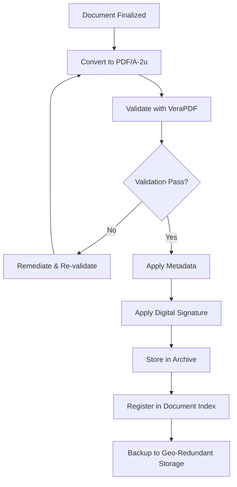

# PDF Document Repository Standards

## Comprehensive Standards for PDF Document Management in Pharmaceutical QMS

---

## Source References
- FDA 21 CFR Part 11 (Electronic Records)
- EU GMP Annex 11 (Computerised Systems)
- ISO 19005 (PDF/A Standards)
- ISO 32000 (PDF Specification)
- FDA Guidance: Electronic Source Data
- ISPE GAMP 5
- Date Retrieved: 2026-07-28
- Confidence: 0.95

---

## 1. PDF Standards & Compliance

### 1.1 Required PDF Standards

| Standard | Version | Use Case | Mandatory |
|----------|---------|----------|-----------|
| **PDF/A-1b** | ISO 19005-1 | Long-term archival, regulatory submissions | **Yes** |
| **PDF/A-2u** | ISO 19005-2 | Enhanced archival with Unicode, layers | **Yes** (preferred) |
| **PDF/A-3u** | ISO 19005-3 | Archival with embedded source files | **Yes** (for data packages) |
| **PDF/UA-1** | ISO 14289-1 | Universal accessibility (Section 508) | **Yes** (public docs) |
| **PDF/X-4** | ISO 15930-7 | Print production | **No** (internal only) |
| **PDF/E-1** | ISO 24517 | Engineering workflows | **No** (engineering only) |

### 1.2 Mandatory PDF/A Requirements

| Requirement | PDF/A-1b | PDF/A-2u | PDF/A-3u |
|-------------|----------|----------|----------|
| **Fonts Embedded** | All | All | All |
| **Unicode Mapping** | Not required | Required | Required |
| **Transparency** | Prohibited | Allowed | Allowed |
| **Layers (OCG)** | Prohibited | Allowed | Allowed |
| **Embedded Files** | Prohibited | Prohibited | **Required** |
| **Encryption** | Prohibited | Prohibited | Prohibited |
| **JavaScript** | Prohibited | Prohibited | Prohibited |
| **Audio/Video** | Prohibited | Prohibited | Prohibited |
| **External References** | Prohibited | Prohibited | Prohibited |

---

## 2. PDF Categories & Naming Conventions

### 2.1 Document Categories

| Category Code | Category | Examples | Retention |
|---------------|----------|----------|-----------|
| **REG** | Regulatory Submissions | IND, NDA, ANDA, BLA, MAA, Variations, Annual Reports | Life + 10 yrs |
| **CTD** | Common Technical Document | Module 1-5, eCTD sequences | Life + 10 yrs |
| **GMP** | GMP Compliance | Inspection reports, certificates, audit reports | 10 yrs |
| **SOP** | Standard Operating Procedures | Current & historical versions | Current + 10 yrs |
| **BMR** | Batch Manufacturing Records | BMR, BPR, BLR | 1 yr post expiry |
| **COA** | Certificates of Analysis | Release, stability, retest | 1 yr post expiry |
| **DEV** | Deviation Records | Deviation reports, investigations | 1 yr post expiry |
| **CAPA** | CAPA Records | CAPA forms, effectiveness verification | 1 yr post expiry |
| **CMP** | Complaint Records | Complaint intake, investigation, ADR | 10 yrs |
| **RCL** | Recall Records | Recall strategy, execution, effectiveness | 10 yrs |
| **AUD** | Audit Records | Internal, vendor, regulatory audits | 10 yrs |
| **TRN** | Training Records | Training materials, attendance, assessments | 10 yrs |
| **VAL** | Validation Records | IQ/OQ/PQ, process validation, CSV | Life + 10 yrs |
| **STB** | Stability Data | Protocols, reports, summary sheets | 1 yr post expiry |
| **ENV** | Environmental Monitoring | EM logs, trend reports, excursions | 1 yr post expiry |
| **CAP** | CAPA Records | CAPA initiation, investigation, closure | 1 yr post expiry |
| **CHG** | Change Control | Change requests, assessments, approvals | 10 yrs |
| **RIS** | Risk Management | FMEA, HACCP, risk assessments | Life + 10 yrs |
| **SUP** | Supplier Management | Qualification, audits, quality agreements | 10 yrs |
| **RCL** | Recall Records | Recall strategy, execution, effectiveness | 10 yrs |

### 2.2 Naming Convention

```
[Category]_[DocumentType]_[Product]_[Batch/ID]_[Version]_[Date]_[Status].pdf

Examples:
REG_NDA_001_Lipitor_10mg_Seq0001_v1.0_20260728_Approved.pdf
SOP_QA-001_DeviationMgmt_v3.2_20260115_Effective.pdf
BMR_Lipitor_10mg_LOT20260715A_v1.0_20260720_Completed.pdf
COA_Lipitor_10mg_LOT20260715A_v1.0_20260720_Released.pdf
DEV_2026-0045_Lipitor_10mg_v1.0_20260728_Closed.pdf
CAPA_2026-0089_Lipitor_v1.0_20260815_Verified.pdf
```

---

## 3. PDF Creation Standards

### 3.1 Source Document Requirements

| Source Format | Conversion Method | Validation |
|---------------|-------------------|------------|
| **Microsoft Word** | Save As → PDF/A-2u | VeraPDF validation |
| **Excel** | Save As → PDF/A-2u | VeraPDF validation |
| **PowerPoint** | Save As → PDF/A-2u | VeraPDF validation |
| **Adobe InDesign** | Export → PDF/A-2u | Preflight + VeraPDF |
| **Scanned Documents** | OCR + PDF/A-2u | OCR accuracy >99%, VeraPDF |
| **CAD Drawings** | Export → PDF/A-2u | VeraPDF validation |
| **Legacy PDF** | Convert → PDF/A-2u | VeraPDF validation + visual QA |

### 3.2 Mandatory Document Properties (Metadata)

| Property | Required | Source | Example |
|----------|----------|--------|---------|
| **Title** | Yes | Document title | "Deviation Management SOP" |
| **Author** | Yes | System user | "J. Smith (QA)" |
| **Subject** | Yes | Category + Type | "SOP - Deviation Management" |
| **Keywords** | Yes | Category, Product, Batch, Tags | "SOP; Deviation; QA; Lipitor" |
| **Creator Tool** | Auto | Software | "Microsoft Word for Microsoft 365" |
| **Producer** | Auto | PDF Library | "Microsoft: Print To PDF" |
| **Creation Date** | Auto | System | 2026-07-28T10:30:00Z |
| **Modification Date** | Auto | System | 2026-07-28T14:45:00Z |
| **PDF/A Identifier** | Yes | Conformance | "PDF/A-2u" |
| **Custom: Document Number** | Yes | Doc Control | "SOP-QA-001" |
| **Custom: Version** | Yes | Doc Control | "3.2" |
| **Custom: Effective Date** | Yes | Doc Control | "2026-01-15" |
| **Custom: Status** | Yes | Doc Control | "Effective" |
| **Custom: Product** | If applicable | Product Master | "Lipitor 10mg" |
| **Custom: Batch/Lot** | If applicable | Batch Master | "LOT20260715A" |
| **Custom: Category** | Yes | Taxonomy | "SOP" |
| **Custom: Retention** | Yes | Retention Schedule | "Current + 10 years" |

### 3.3 Technical Requirements

| Requirement | Specification |
|-------------|---------------|
| **Color Space** | sRGB for RGB; CMYK for print-ready |
| **Image Resolution** | 300 DPI minimum for images; 600 DPI for line art |
| **Compression** | Lossless (CCITT Group 4 for B&W; JPEG2000 lossless for color) |
| **Fonts** | All fonts embedded (subset allowed); OpenType/TrueType preferred |
| **Bookmarks** | Required for documents >10 pages; hierarchical |
| **Hyperlinks** | Internal links preserved; external links documented |
| **Forms** | PDF/A-2u: static forms only; no JavaScript |
| **Digital Signatures** | PAdES-BES/LTV; visible signature appearance |
| **Redaction** | True redaction (content removal); not masking |
| **Watermarks** | "CONTROLLED COPY" / "OBSOLETE" / "DRAFT" as applicable |
| **Page Labels** | Roman for front matter, Arabic for body |

---

## 4. Validation & Quality Assurance

### 4.1 Validation Checklist (Per Document)

| Check | Tool | Pass Criteria |
|-------|------|---------------|
| **PDF/A Conformance** | VeraPDF / pdfaPilot | PASS (0 errors) |
| **Font Embedding** | VeraPDF / Preflight | All fonts embedded |
| **Unicode Mapping** | VeraPDF | PASS (PDF/A-2u/3u) |
| **Metadata Completeness** | Custom Script | All required fields populated |
| **Visual Fidelity** | Manual QA | Pixel-perfect vs source |
| **Bookmark Structure** | Manual QA | Hierarchical, accurate |
| **Hyperlink Integrity** | Automated Check | All internal links resolve |
| **Digital Signature** | Adobe/PAdES Validator | Valid, LTV enabled |
| **Redaction Verification** | Content Extraction | No hidden content |
| **Accessibility (PDF/UA)** | PAC 3 / axe | WCAG 2.1 AA compliant |

### 4.2 Automated Validation Pipeline

```yaml
# Example CI/CD Pipeline Stage
pdf_validation:
  stage: validate
  script:
    - verapdf --format xml --output validation.xml "${PDF_FILE}"
    - python validate_metadata.py "${PDF_FILE}" --schema metadata_schema.json
    - python visual_diff.py "${SOURCE_FILE}" "${PDF_FILE}" --threshold 0.99
    - python check_signatures.py "${PDF_FILE}" --require-ltv
  artifacts:
    reports:
      - validation.xml
      - metadata_report.json
      - visual_diff_report.html
  rules:
    - if: $CI_PIPELINE_SOURCE == "merge_request_event"
```

---

## 5. Regulatory Submission PDF Requirements

### 5.1 eCTD PDF Specifications

| Module | PDF/A Version | Special Requirements |
|--------|---------------|---------------------|
| **Module 1** | PDF/A-2u | Regional administrative forms; signatures |
| **Module 2** | PDF/A-2u | Summaries; bookmarks per ICH M4 |
| **Module 3** | PDF/A-2u | Drug substance/product; bookmarks per ICH M4R2 |
| **Module 4** | PDF/A-2u | Nonclinical study reports; OECD GLP compliance |
| **Module 5** | PDF/A-2u | Clinical study reports; ICH E3 structure |

### 5.2 eCTD Specific Requirements

| Requirement | Specification |
|-------------|---------------|
| **File Naming** | ICH eCTD specification v4.0 |
| **Folder Structure** | ICH M4/M4R2 compliant |
| **Checksums** | MD5/SHA-256 in index.xml |
| **File Size** | < 500 MB per file (split if larger) |
| **Pagination** | Continuous across modules |
| **Cross-references** | Relative paths only |
| **Signatures** | PAdES-BES with LTV |
| **Checksum Verification** | Automated at submission |

---

## 6. Archival & Lifecycle Management

### 6.1 Archival Workflow



### 6.2 Retention & Disposition

| Document Category | Minimum Retention | Disposition Authority | Method |
|-------------------|-------------------|----------------------|--------|
| **Regulatory Submissions** | Life of product + 10 yrs | Regulatory Affairs | Secure destruction with certificate |
| **Batch Records** | 1 yr post expiry | QA | Secure destruction with certificate |
| **Validation Records** | Life + 10 yrs | Validation Lead | Secure destruction with certificate |
| **Audit/Inspection** | 10 years | QA | Secure destruction with certificate |
| **Training Records** | 10 years | HR/Training | Secure destruction with certificate |
| **Supplier Records** | 10 years | Procurement/QA | Secure destruction with certificate |

---

## 7. Tools & Software

### 7.1 Recommended Toolchain

| Function | Recommended Tools | License |
|----------|-------------------|---------|
| **PDF/A Creation** | Microsoft Office, Adobe Acrobat Pro, LibreOffice, pdfaPilot | Commercial/FOSS |
| **Validation** | VeraPDF (CLI/GUI), pdfaPilot, 3-Heights PDF Validator | FOSS/Commercial |
| **Metadata Management** | ExifTool, pdfaPilot, custom scripts | FOSS/Commercial |
| **Digital Signatures** | Adobe Acrobat Sign, DocuSign, OpenTrust, Ascertia | Commercial |
| **OCR** | ABBYY FineReader, Adobe Acrobat, Tesseract | Commercial/FOSS |
| **Redaction** | Adobe Acrobat Pro, pdfaPilot, iText | Commercial |
| **Accessibility (PDF/UA)** | axesPDF, PAC 3, axesPDF QuickFix | Commercial/FOSS |
| **Batch Processing** | pdfaPilot Server, 3-Heights PDF Processor | Commercial |
| **Archival Storage** | AWS S3 Glacier, Azure Archive, On-prem Object Store | Commercial |

---

## 8. Quality Metrics & Reporting

### 8.1 Key Performance Indicators

| KPI | Target | Measurement |
|-----|--------|-------------|
| **PDF/A Conformance Rate** | 100% | % documents passing VeraPDF |
| **Metadata Completeness** | 100% | % documents with all required fields |
| **Validation Cycle Time** | < 30 min/doc | Avg time from source to validated PDF/A |
| **Rejection Rate** | < 1% | % documents requiring rework |
| **Search Retrieval Time** | < 5 seconds | Avg search response time |
| **Storage Cost per GB** | < $0.02/GB/mo | Archived storage cost |
| **Recovery Time Objective (RTO)** | < 4 hours | Time to restore from archive |
| **Recovery Point Objective (RPO)** | < 1 hour | Max data loss in disaster |

---

## Metadata

```json
{
  "document_id": "pdf_repository_standards",
  "category": "pdfs",
  "subcategory": "repository_standards",
  "source_type": "Compiled_Technical_Standards",
  "authority": "FDA/EMA/ICH/ISO/ISPE",
  "version": "2026.1",
  "format": "Markdown",
  "retrieved": "2026-07-28",
  "confidence": 0.95,
  "tags": ["PDF_Standards", "PDF_A", "PDF_UA", "Archival_Standards", "Regulatory_Submissions", "eCTD", "Metadata_Standards", "Validation", "Digital_Signatures", "Retention", "Document_Control", "GMP_Documentation"]
}
```