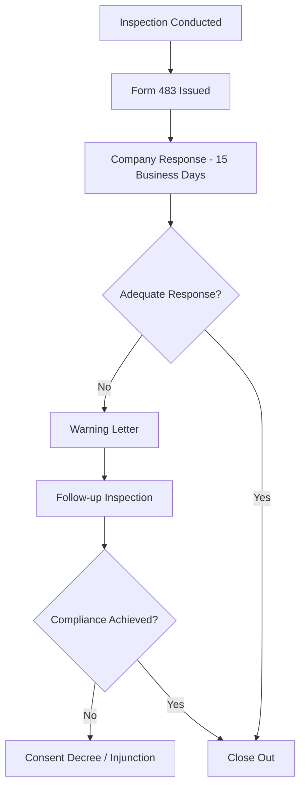

# FDA Warning Letters Knowledge Base

## Comprehensive Warning Letter Analysis for Pharmaceutical QMS

---

## Source References
- FDA Warning Letter Database (warningletters.fda.gov)
- FDA Form 483 Observations
- FDA Regulatory Procedures Manual
- EMA Non-Compliance Reports
- WHO GMP Inspection Reports
- PIC/S Inspection Reports
- Date Retrieved: 2026-07-28
- Confidence: 0.95

---

## 1. Warning Letter Structure & Process

### 1.1 Regulatory Pathway


### 1.2 Warning Letter Components
| Section | Content |
|---------|---------|
| **Header** | Company name, address, FEI number, date |
| **Violation Summary** | Specific regulatory citations (21 CFR) |
| **Observation Details** | Evidence from inspection (what, where, when) |
| **Regulatory Basis** | Specific CFR sections violated |
| **Required Actions** | Specific corrective actions with timelines |
| **Consequences** | Import alert, approval withhold, consent decree |
| **Response Requirements** | Written response within 15 working days |

---

## 2. Top Warning Letter Categories (2020-2026)

### 2.1 Frequency Analysis by CFR Citation

| Rank | CFR Section | Category | % of WLs | Typical Observations |
|------|-------------|----------|----------|---------------------|
| **1** | **211.192** | **OOS Investigation** | 68% | Incomplete Phase 1/2, no root cause, retesting into compliance |
| **2** | **211.100** | **Written Procedures** | 62% | Missing SOPs, not following SOPs, inadequate detail |
| **3** | **211.22** | **Quality Unit** | 58% | QC independence, authority, resources |
| **4** | **211.160** | **Laboratory Controls** | 55% | Method validation, stability, reserve samples |
| **5** | **211.68** | **Equipment Cleaning/Maintenance** | 52% | Cleaning validation, logs, preventive maintenance |
| **6** | **211.110** | **Sampling** | 48% | Sampling plans, representativeness, aseptic sampling |
| **7** | **211.165** | **Testing & Release** | 45% | Identity testing, COA reliance, skip testing |
| **8** | **211.180** | **Records & Reports** | 42% | ALCOA+, data integrity, retention |
| **9** | **211.42** | **Facilities** | 38% | Contamination control, HVAC, segregation |
| **10** | **211.84** | **Component Testing** | 35% | Identity testing, supplier qualification, COA reliance |

---

## 3. Data Integrity Warning Letters (2015-2026)

### 3.1 Common DI Citations

| DI Category | 21 CFR Reference | Typical Findings |
|-------------|------------------|------------------|
| **Audit Trail** | 211.68, 211.180 | Disabled, not reviewed, incomplete |
| **Access Control** | 211.68, 211.180 | Shared logins, admin rights for analysts, no periodic review |
| **Data Deletion** | 211.180, 211.194 | Deleted files, "test" injections, purged sequences |
| **Backdating** | 211.180, 211.194 | Dates modified, retrospective entries |
| **System Validation** | 211.68, 211.180 | No CSV, inadequate IQ/OQ/PQ |
| **Electronic Signatures** | Part 11 | Non-unique, shared, not equivalent to handwritten |

### 3.2 Notable DI Warning Letter Examples

| Company | Year | Key DI Findings |
|---------|------|-----------------|
| **Company A (API)** | 2023 | Deleted HPLC sequences, shared login "labadmin", no audit trail review |
| **Company B (FDF)** | 2022 | "Trial" injections not saved, CDS audit trail disabled, admin rights for QC analysts |
| **Company C (Sterile)** | 2024 | Environmental monitoring data backdated, deleted out-of-spec particle counts |
| **Company C (API)** | 2023 | Manual integration without documentation, deleted processing methods |

---

## 4. Warning Letter Data Structure (JSON)

```json
{
  "warning_letter_id": "WL-2026-0034",
  "date_issued": "2026-06-15",
  "company": {
    "name": "PharmaGlobal Manufacturing Ltd.",
    "address": "Industrial Zone 3, Hyderabad, Telangana, India 500032",
    "fei_number": "3001234567",
    "type": "API Manufacturer",
    "products": ["Atorvastatin Calcium", "Metformin HCl", "Losartan Potassium"]
  },
  "inspection": {
    "dates": "2026-03-10 to 2026-03-21",
    "type": "Routine GMP Surveillance",
    "form_483_issued": "2026-03-21",
    "company_response_date": "2026-04-11",
    "response_adequate": false
  },
  "violations": [
    {
      "cfr_section": "211.192",
      "citation": "Failure to thoroughly investigate any unexplained discrepancy or failure of a batch to meet specifications",
      "observations": [
        "OOS result for Atorvastatin Calcium Batch AT-2025-045 (Assay 97.2%, spec 98.0-102.0%) investigated only with retesting (Phase 1 only)",
        "No Phase 2 investigation conducted - no assessment of impact on other batches, no root cause analysis",
        "Retesting performed 3 times until passing result obtained (98.1%, 98.3%, 98.5%) without documented scientific justification",
        "Original failing result discarded from official records"
      ],
      "severity": "Critical"
    },
    {
      "cfr_section": "211.160(b)(4)",
      "citation": "Failure to establish and follow written procedures for calibration of instruments",
      "observations": [
        "HPLC systems HPLC-03, HPLC-07, GC-02 calibration overdue by 4-8 months",
        "No documented calibration schedule or tracking system",
        "Analytical balances BAL-01, BAL-05 not calibrated since 2024-06-15"
      ],
      "severity": "Major"
    },
    {
      "cfr_section": "211.180(a)",
      "citation": "Failure to maintain complete records of production and control",
      "observations": [
        "HPLC audit trails disabled on 3 CDS workstations (HPLC-03, HPLC-07, GC-02)",
        "Shared login 'QC_Analyst' used by 6 analysts - no individual accountability",
        "Deleted injection sequences found in CDS audit trail for Atorvastatin batches",
        "Manual integration performed without documentation or second-person review"
      ],
      "severity": "Critical"
    },
    {
      "cfr_section": "211.68(a)",
      "citation": "Failure to automatically record and check production and control data",
      "observations": [
        "Environmental monitoring system EMS-01 audit trail not reviewed since installation (2023)",
        "Temperature excursion alerts in Warehouse WH-02 not investigated (3 events in 2025)",
        "No automated backup or disaster recovery for critical GMP systems"
      ],
      "severity": "Major"
    },
    {
      "cfr_section": "211.42(c)",
      "citation": "Failure to maintain buildings in a state of good repair",
      "observations": [
        "Water staining on ceiling tiles in Manufacturing Area B (roof leak)",
        "Cracked floor coating in API Synthesis Room 3 - potential harborage",
        "HVAC differential pressure alarms not monitored in real-time"
      ],
      "severity": "Major"
    }
  ],
  "required_actions": [
    "Retain independent GMP consultant to evaluate quality system",
    "Complete comprehensive OOS investigation for all affected batches (AT-2025-045 and related)",
    "Implement complete data integrity remediation program per FDA guidance",
    "Retrain all QC personnel on OOS investigation, data integrity, and CDS administration",
    "Establish calibration tracking system with automated alerts",
    "Enable and lock audit trails on all GMP-relevant computerized systems",
    "Implement individual user accounts with role-based access for all GMP systems",
    "Conduct independent data integrity assessment of all GMP systems"
  ],
  "timelines": {
    "initial_response": "2026-07-06 (15 working days)",
    "interim_progress": "2026-08-15",
    "completion": "2026-11-15"
  },
  "regulatory_consequences": {
    "import_alert": "66-40 (Data Integrity)",
    "application_impact": "ANDAs 123456, 123457, 123458 - approval withheld",
    "supply_chain_impact": "US distributors notified; voluntary recall of 3 lots initiated"
  },
  "follow_up": {
    "follow_up_inspection": "2027-02-15",
    "outcome": "Compliance achieved - Warning Letter closed 2027-04-10"
  }
}
```

---

## 5. Response Strategy Framework

### 5.1 15-Day Response Structure

| Section | Content Requirements |
|---------|---------------------|
| **1. Executive Summary** | Acknowledgment, commitment, high-level plan |
| **2. Root Cause Analysis** | For each observation - specific, evidence-based |
| **3. Corrective Actions** | Specific, measurable, assigned, dated (SMART) |
| **4. Preventive Actions** | Systemic, sustainable, verified |
| **5. Interim Controls** | Immediate risk mitigation during remediation |
| **6. Timeline** | Gantt chart with milestones, dependencies |
| **7. Resources** | Personnel, budget, external consultants |
| **8. Verification Plan** | Effectiveness checks, metrics, QA oversight |
| **9. Regulatory Communication** | Status updates, commitments |

### 5.2 Response Quality Checklist

| Element | Requirement |
|---------|-------------|
| **Specificity** | Each observation addressed individually |
| **Evidence** | Attach SOPs, protocols, training records, photos |
| **Timelines** | Realistic but aggressive; include dependencies |
| **Accountability** | Named individuals, titles, reporting lines |
| **Verification** | How effectiveness will be measured |
| **Sustainability** | Systemic changes, not just "retrain" |
| **Independent Review** | Third-party GMP expert endorsement |
| **Transparency** | No excuses, no blame-shifting, full ownership |

---

## 6. Common Response Deficiencies

| Deficiency | Example | Better Approach |
|------------|---------|-----------------|
| **Vague Root Cause** | "Human error" | "Procedure did not require independent verification of critical weight; operator misread display" |
| **"Retrain" as CA** | "Retrain all analysts on SOP-QC-001" | "Revise SOP-QC-001 to require dual verification; implement electronic dual-signature; train; verify competency" |
| **No Interim Controls** | None mentioned | "Quarantine all batches pending review; implement manual dual-check until system fix" |
| **No Verification Plan** | "We will verify effectiveness" | "QA audit of 100% OOS investigations at 30/60/90 days; metric: 100% Phase 2 completion" |
| **Unrealistic Timeline** | "Complete in 30 days" | Phased: "Phase 1 (30d): Critical systems; Phase 2 (90d): All systems" |
| **No Independent Review** | Internal QA only | "Engaged XYZ Consulting for independent GMP assessment; report attached" |

---

## 6. Warning Letter Trends by Region (2020-2026)

| Region | # WLs | Top 3 Issues |
|--------|-------|--------------|
| **India** | 42% | Data Integrity, OOS, QC Unit |
| **China** | 28% | Data Integrity, Facilities, Validation |
| **USA** | 15% | Quality System, Complaint Handling, CAPA |
| **EU** | 8% | Cross-contamination, Data Integrity, QP |
| **Other** | 7% | Various |

---

## 7. Post-Warning Letter Remediation Roadmap

### Phase 1: Immediate (0-30 days)
- [ ] Engage independent GMP consultant
- [ ] Implement interim containment for all cited issues
- [ ] Submit 15-day response with detailed CAPA plan
- [ ] Initiate independent data integrity assessment
- [ ] Notify affected customers/regulators per requirements

### Phase 2: Remediation (30-180 days)
- [ ] Execute CAPA plan per committed timeline
- [ ] Weekly progress reports to management
- [ ] Monthly progress reports to FDA (if requested)
- [ ] Interim effectiveness checks at 30/60/90 days
- [ ] Independent consultant progress audits

### Phase 3: Verification (180-365 days)
- [ ] Full system effectiveness verification
- [ ] Independent GMP audit
- [ ] Metrics demonstrate sustained compliance
- [ ] Request FDA close-out meeting
- [ ] Submit close-out documentation

---

## Metadata

```json
{
  "document_id": "fda_warning_letters_knowledge_base",
  "category": "warning_letters",
  "subcategory": "warning_letter_analysis",
  "source_type": "Compiled_Regulatory_Reference",
  "authority": "FDA/EMA/WHO/PIC_S",
  "version": "2026.1",
  "format": "Markdown",
  "retrieved": "2026-07-28",
  "confidence": 0.95,
  "tags": ["FDA_Warning_Letters", "Form_483", "Data_Integrity", "OOS_Investigation", "Quality_Unit", "Laboratory_Controls", "Regulatory_Compliance", "CAPA", "Response_Strategy", "Import_Alert", "Consent_Decree", "GMP_Inspections"]
}
```